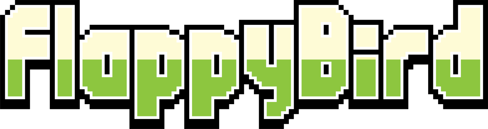
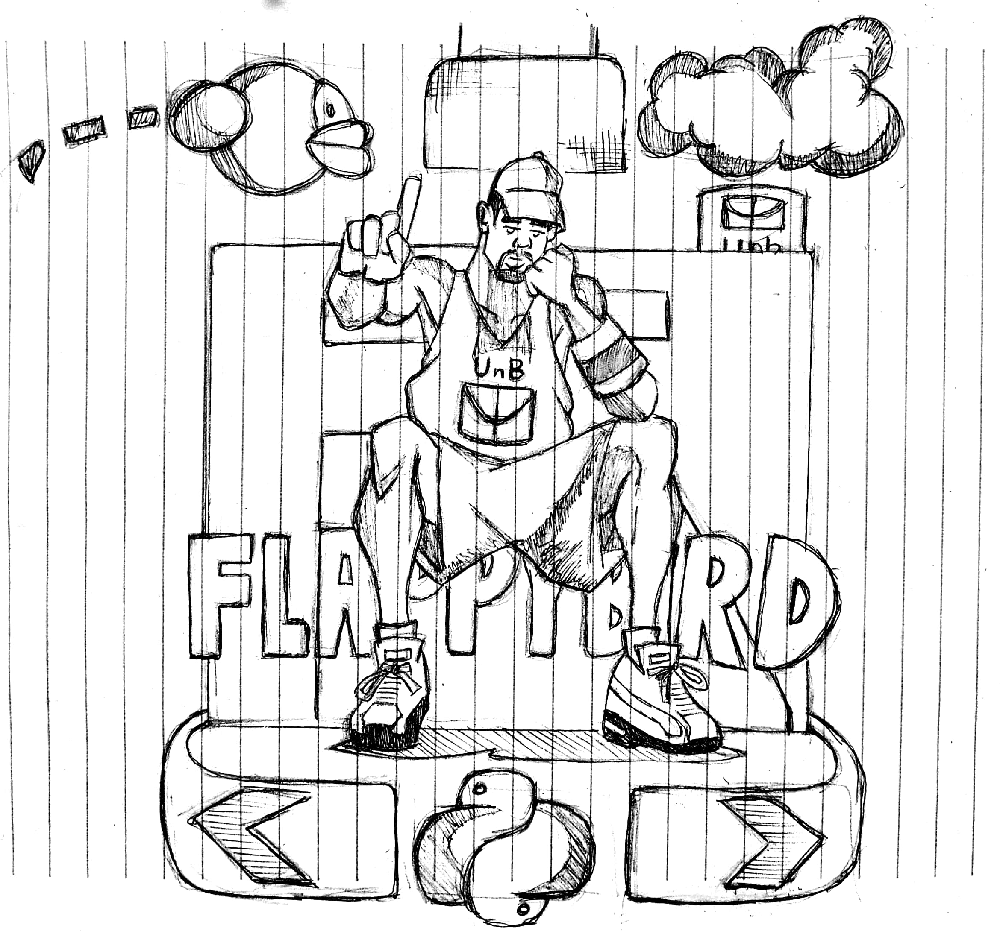
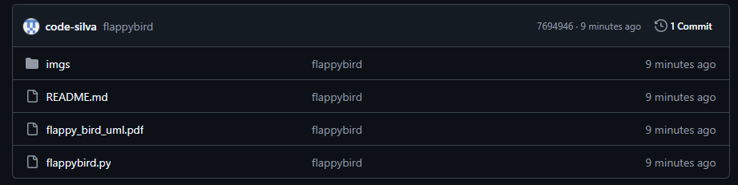
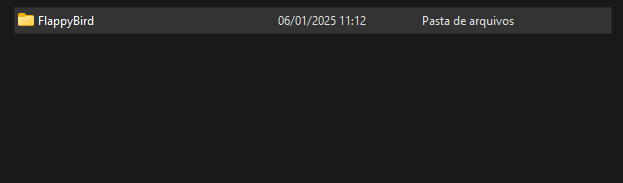
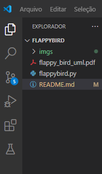
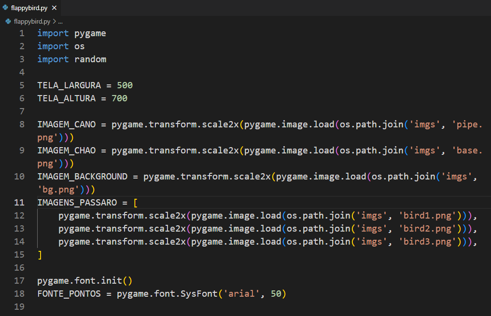
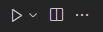
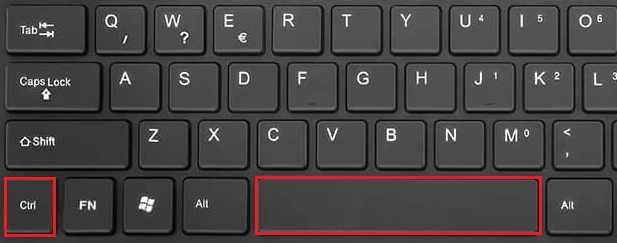

<h1 align="center" style="font-weight: bold;">🐤</h1>

 <a href="#tech">Tecnologias</a> • 
 <a href="#started">Instrução de uso</a> • 
   •
 <a href="#contribute">Considerações</a>

    <b>Flappy Bird: Um Jogo Simples e Marcante</b> 

Flappy Bird é um jogo casual que conquistou o mundo graças à sua simplicidade e mecânica desafiadora. Criado por Dong Nguyen, o projeto foi desenvolvido em apenas três dias e lançado inicialmente para iOS em 2013 sob o nome “Flap Flap”. Sua jogabilidade consiste em controlar um pássaro em voo contínuo, desviando de obstáculos em forma de canos, com cada toque na tela impulsionando-o levemente para cima. Essa mecânica simples rapidamente revelou-se frustrante e viciante, criando uma relação de amor e ódio entre os jogadores.  

Após um início tímido, o jogo começou a ganhar popularidade no final de 2013, atingindo o topo dos rankings da App Store em dezembro. Com isso, memes e discussões online sobre a dificuldade e o estilo gráfico do jogo – inspirado em jogos clássicos de 8 bits – proliferaram. Em janeiro de 2014, Flappy Bird tornou-se um fenômeno global, gerando milhares de downloads diários e consolidando sua posição como um dos jogos mais icônicos da década.  

Embora o criador tenha removido o jogo das lojas digitais em fevereiro de 2014 devido à pressão e ao impacto inesperado da fama, Flappy Bird deixou uma marca indelével na indústria dos jogos móveis, influenciando o design e a simplicidade dos jogos casuais que vieram depois. Este projeto recria o clássico Flappy Bird usando a biblioteca Pygame e os conceitos de Orientação a Objetos em Python, permitindo que você reviva essa experiência nostálgica diretamente no seu computador.

     <a href="PROJECT__URL">📱 Visit this Project</a>

<h2 id="layout">🎨 Flappy Bird: Um Jogo Simples e Marcante</h2>

    

<h2>Detalhes Técnicos</h2>

<strong>
  

    O script é organizado em três classes principais:
  

</strong>

Classe <em>Passaro</em>

<ins>Responsabilidade</ins>

  <ul>
  <li>Controla o pássaro, incluindo movimentação, animação e rotação.
  </li>
  </ul>
 
<strong>Atributos</strong>
  
  
  <ul>
      <li>x, y: Coordenadas do pássaro.</li>
      <li>angulo: Controle da rotação.</li>
      <li>velocidade e tempo: Movimentação baseada em física.</li>
      <li>contagem_imagem: Para alternar entre as imagens do pássaro.</li>
    </ul>
  
   
  <strong>Métodos</strong>
    
  <ul>
    <li>pular(): Define a velocidade inicial para "pular".</li>
    <li>mover(): Calcula o deslocamento vertical e ajusta o ângulo do pássaro.</li>
    <li>desenhar(tela): Alterna entre as imagens do pássaro e as desenha na tela.</li>
    <li>get_mask(): Retorna uma máscara para detectar colisões.</li>
</ul>

Classe <em>Cano</em>

<ins>Responsabilidade </ins>

Gera os canos, controla sua movimentação e verifica colisões com o pássaro.

<strong>Atributos </strong>

<ul>
  <li>
    x: Posição horizontal do cano.
    altura, pos_topo, pos_base: Dimensões e posições dos canos.
  </li>
  
  <li>CANO_TOPO, CANO_BASE: Imagens do cano invertidas e normais.</li>
</ul>

<strong>Métodos</strong>

<ul>
  <li>definir_altura(): Gera alturas aleatórias para os canos.</li>
  <li>mover(): Desloca os canos horizontalmente.</li>
  <li>desenhar(tela): Desenha os canos na tela.</li>
  colidir(passaro): Verifica colisões usando máscaras.
</ul>

Classe <em>Chao</em>

<ins>Responsabilidade</ins>

<ul>
  <li>Controla o chão móvel para criar uma ilusão de deslocamento.</li>
</ul>

<strong>Atributos</strong>

<ul>
  <li>x1, x2: Coordenadas horizontais para o movimento contínuo.</li>
  <li>y: Coordenada vertical fixa do chão.</li>
</ul>

<strong>Métodos</strong>

mover(): Move o chão horizontalmente, reposicionando-o quando sai da tela.
desenhar(tela): Desenha o chão na tela.
3. Funções Globais
desenhar_tela(tela, passaros, canos, chao, pontos):

Atualiza a interface gráfica com todos os elementos do jogo e a pontuação.
main():

Gerencia o loop principal do jogo:
Detecta eventos de entrada do usuário.
Atualiza a posição dos objetos (pássaros, canos, chão).
Verifica colisões e pontuação.
Chama a função desenhar_tela() para atualizar os gráficos.

<h2 id="tech">💻 Tecnologias</h2>

- Python:

    Criada em 1991 por Guido van Rossum, um programador holandês, a linguagem foi desenvolvida com o objetivo de ser fácil de aprender e de usar 📚💻. A origem do nome Python vem do programa de televisão Monty Python's Flying Circus, que era popular entre os programadores da época 📺
- Pygame:

    Biblioteca essencial para o desenvolvimento de jogos em Python.
Usada para criar gráficos, detectar eventos do usuário, e manipular elementos como imagens, animações e sons.
- Bibliotecas Padrão:

    os: Gerenciamento de caminhos de arquivos e diretórios.
    random: Geração de números aleatórios, útil para criar variação na altura dos canos.
- Estruturas e Recursos do Python:

    Classes e objetos para modelar os elementos do jogo.
    Funções globais para lógica geral (como main() e desenhar_tela()).
    Constantes para configuração de parâmetros do jogo, como dimensões da tela e velocidade dos elementos.

<h2 id="started">🚀 Instrução de Uso</h2>

Segue abaixo todos os procedimentos necessários para o funcionamento do jogo em sua máquina:

<ol>
    <li>
        
Baixe "flappybird.py" e os arquivos presentes na pasta "imgs" do repositório flappybird.

        
    </li>
    <li>
       
Com todos os arquivos da pasta Flappy Bird baixados, clique com o botão direito do mouse, sobre a seguinte pasta.( indicado renomear a pasta com o nome flappybird ) e depois em "Mostrar mais opções"
 
       
        
       
    </li>
    <li>
      
Encontre a opção, "Abrir com o Code" ou "Open with Code" em inglês.

      
    </li>
    <li>
      
Ao abrir a pasta com o VSCode, na aba do explorador de arquivos do editor de código, clique sobre o arquivo nomeado "flappybird.py"

      
    </li>
    <li>
      
Executados todos os passos anteriores de forma correta, no arquivo  "flappybird.py" clique sobre o botão "Run Code", do VSCODE, para o ver o jogo em funcionamento.

      
      
      </li>
      <li>
      

      Pressione a tecla "espaço do teclado" e divirta-se!!!
      

      
    </li>
</ol>

<h3>Pré-Requisitos</h3>

Todos os pré requisitos necessários para executar o jogo.

Programas:

- [Python](https://www.python.org/)
- [VSCode](https://code.visualstudio.com/)
- [Pygame](https://www.pygame.org/news) ("opcional, biblioteca já importada no arquivo principal")

<h2 id="colab">🤝 Colaboradores</h2>

Um agradecimento especial a todas as pessoas que contribuíram para este projeto.

<table>
  <tr>
    <td align="center">
      <a href="#">
         
        
          <b>Anderson Fernandes</b>
        
      </a>
    </td>
    <td align="center">
      <a href="#">
         
        
          <b>Dong Nguyen</b>
        
      </a>
    </td>
    
  </tr>
</table>

<h2 id="contribute">📕 Considerações</h2>

Neste projeto, foi possível aplicar de forma prática os conceitos de Programação Orientada a Objetos (POO), integrando-os com outras áreas do conhecimento presentes na grade curricular da faculdade, como física e matemática. Esses conhecimentos foram essenciais para modelar o movimento do pássaro e a dinâmica dos obstáculos, trazendo realismo e desafio ao jogo.

Além disso, o desenvolvimento do projeto proporcionou a oportunidade de exercitar o pensamento crítico na criação e organização de um software que equilibra interatividade e entretenimento para o usuário. A estruturação do código exigiu planejamento cuidadoso, foco na modularidade e atenção à experiência do jogador.

Por fim, este trabalho também permitiu desenvolver competências fundamentais, como documentação de projetos, construção de software e lógica de programação. A combinação desses elementos não só resultou em um produto final funcional e atrativo, mas também reforçou habilidades importantes para a atuação na área de tecnologia e desenvolvimento de sistemas.
<footer>
  
Created by Anderson

</footer>